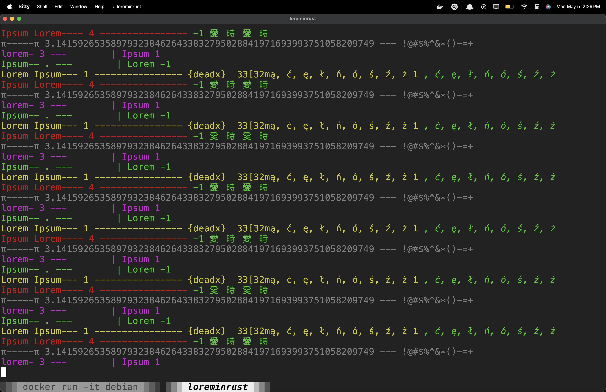

# LoremInRust




## MacOS

First inside of the `LoremInRust` folder run:

```bash
cargo install --path .
```

Now we add the `cargo` bin to the `$PATH`

```bash
cat "/Users/YourUserHere/.cargo/bin" | cat ~/.zshrc -
```

Run with:
```bash
loreminrust
```

## Linux

First inside of the `LoremInRust` folder run:
```bash
cargo install --path .
```

Run with:
```
loreminrust
```